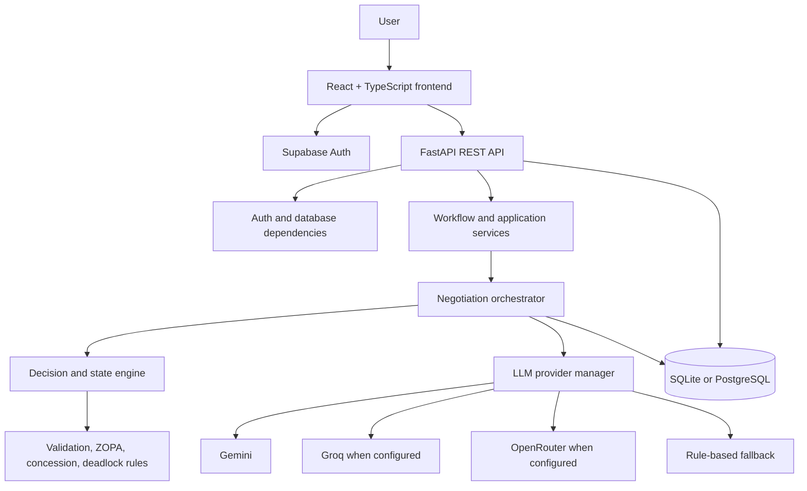

# Architecture and Runtime Flow

## High-Level Architecture



## Request-to-Outcome Flow

1. The frontend stores setup choices in Zustand and sends them to the backend.
2. The backend creates a `NegotiationSession` and related agent records.
3. Setup endpoints update agent details, goals, and constraints.
4. The review endpoint marks the setup as explicitly confirmed.
5. The start endpoint runs workflow validation and changes the session into a running state.
6. For AI vs AI, an in-process runner repeatedly requests the next turn. For Human vs AI, execution pauses for the user's turn when required.
7. The orchestrator loads the session and public message history, selects the speaker, and builds a `NegotiationState`.
8. A reasoning node obtains a structured decision from the provider manager. A validator and evaluator then apply deterministic rules.
9. The accepted message and usage information are persisted. Session fields such as round, speaker, latest offer, and status are updated.
10. A terminal status triggers outcome report generation and persistence.

## Per-Turn Control Flow

```text
Acquire session lock
  -> Load session, agents, and messages
  -> Select current speaker
  -> Validate human input when applicable
  -> Build negotiation state
  -> Produce structured agent decision
  -> Validate decision and offer
  -> Apply state transition and evaluate outcome
  -> Persist message and LLM usage
  -> Update session progress
  -> Generate report if terminal
```

A per-session asynchronous lock prevents overlapping turn operations from corrupting the same negotiation session.

## Information Boundaries

Prompt construction should expose the public transcript and the current agent's own private goals and constraints. Other agents' private reservation values should not be placed in the current agent's context.

## Persistence Model

The main durable objects are:

- User profile
- Preset scenario
- Negotiation session
- Agent configuration
- Agent goal and constraint
- Negotiation message
- LLM usage record
- Outcome report

The negotiation session owns the execution state. Messages and reports provide the historical record used by the UI and analytics.

## Current Implementation Notes

- Startup creates database tables and seeds preset scenarios.
- SQLite is the default local database; PostgreSQL/Supabase is supported through async SQLAlchemy.
- The active frontend/backend connection is REST-based.
- The project has provider failover and a rule-based fallback path, so execution can remain deterministic when an external LLM is unavailable.
